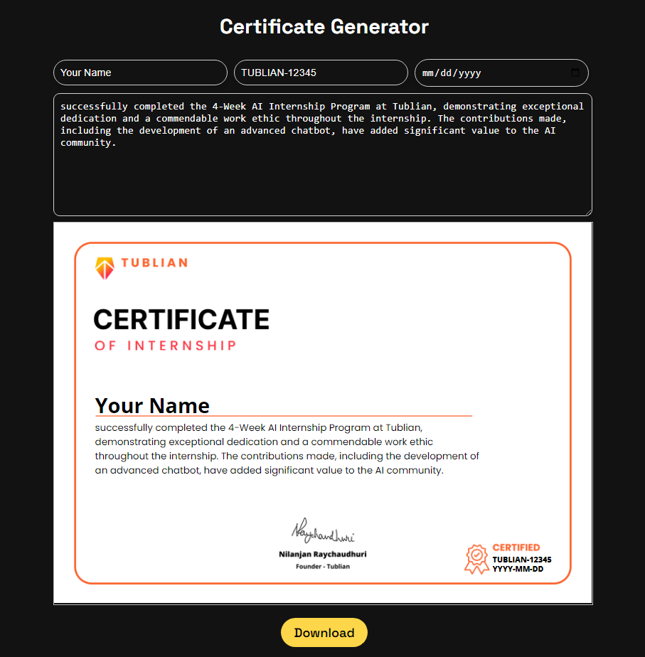

# Certificate Generator 



This project is a **Certificate Generator** built using **ReactJS** and **Vite**. It allows users to fill in their name, ID, date, and a custom message to generate a personalized certificate, which can be downloaded as an image or a PDF.

## Features
- **ReactJS** for dynamic UI components.
- Input fields for user details (Name, ID, Date, Custom Message).
- Real-time certificate preview using **html2canvas**.
- Download the certificate as an image or PDF using **jsPDF**.
- Responsive design with modern styling.

## Technologies Used
- **ReactJS** (Frontend Framework)
- **Vite** (Fast development environment)
- **html2canvas** (for rendering the certificate as an image)
- **jsPDF** (for generating the PDF download)
- **CSS3** (Styling with Poppins and Open Sans fonts)

## Getting Started

Follow these instructions to set up and run the project locally.

### Prerequisites
Make sure you have the following installed on your local machine:
- **Node.js** (version 16+)
- **npm** (Node package manager)

### Installation

1. Clone the repository:
   ```bash
   git clone https://github.com/DineshJuluri/tublian-challenge-certificate-generator/
2. Navigate to the project directory:
   ```bash
   cd tublian-challenge-certificate-generator
3. Install the dependencies:
   ```bash
   npm install
4. Start the development server:
   ```bash
   npm run dev

     
